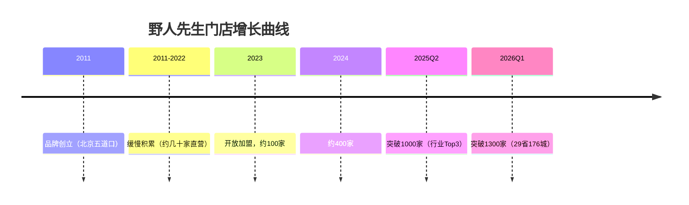
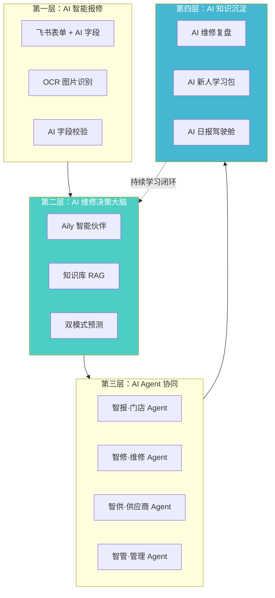
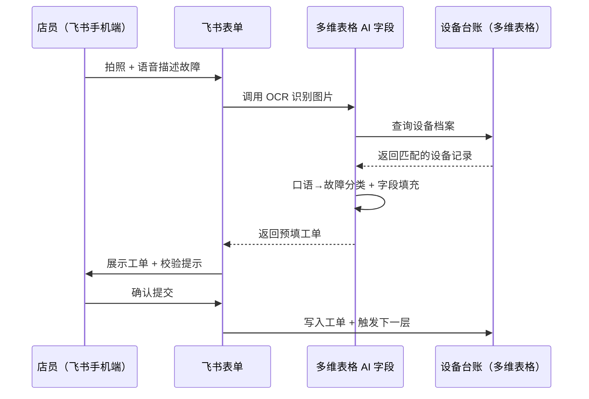
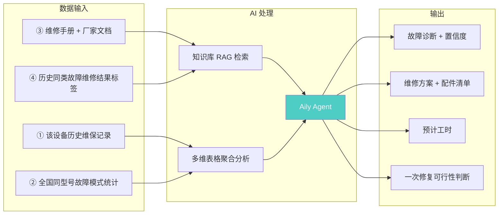
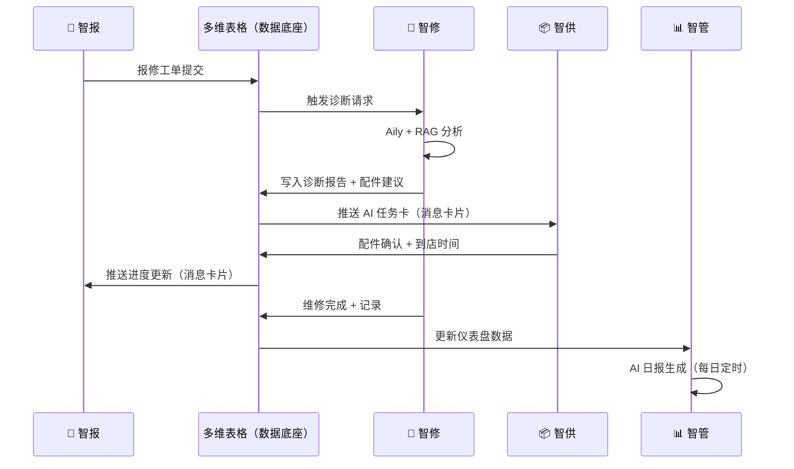
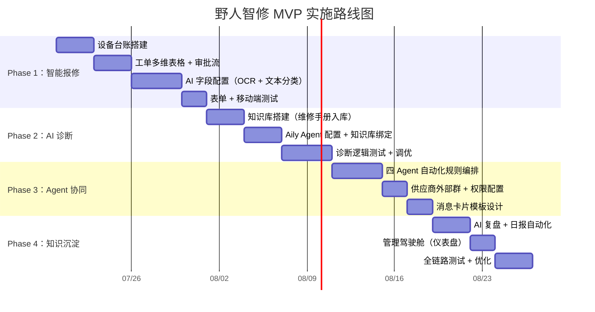
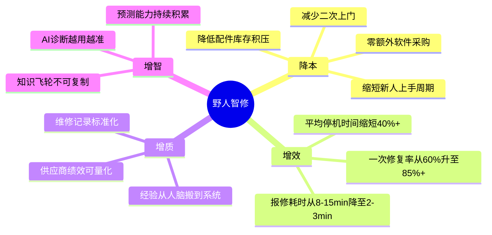

# 野人智修 —— 方案补充说明

> **Supporting Materials | 2026 AI 先锋未来人才大赛**
>
> 命题企业：野人先生 | 赛道：AI + 营销推广 | 区域：华北
---

## 目录

1. [项目背景与业务痛点分析](#1)
2. [为什么必须选择飞书 AI](#2)
3. [AI 能力设计逻辑](#3)
4. [MVP 实施路线图](#4)
5. [数据来源与可信性说明](#5)
6. [可落地性分析](#6)
7. [风险与边界](#7)
8. [项目价值总结](#8)

---

## <a id="1"></a>一、项目背景与业务痛点分析

### 1.1 野人先生：两年 13 倍的"甜蜜压力"



| 维度 | 现状 | 挑战 |
|------|------|------|
| 门店规模 | 1300+ 家 | 管理半径急剧扩大 |
| 扩张模式 | 加盟为主（具体比例未公开） | 标准化管控难度大 |
| 核心设备 | 意大利进口 Gelato 凝冻机 | 配件从国外调货，动辄数周 |
| 产品特性 | 当天现做，冷链依赖 | 设备故障 = 当天停售 |
| 人才结构 | 快速扩张带来大量新人 | 设备操作和故障判断经验不足 |

> **来源**：野人先生官网、36氪专访（2025）、新华网专访崔渐为（2025.08）、新京报报道（2025）

### 1.2 设备维修现状：不是缺系统，是缺判断


**两次上门才修好，根因不在流程，在决策。**

### 1.3 痛点到根因的映射

| 表象痛点 | 深层根因 | 缺失能力 |
|----------|----------|----------|
| 店员报修信息不准确 | 店员不是设备专家，没有判断依据 | **AI 故障识别 + 标准化录入** |
| 维修师傅带错配件 | 出发前不知道"什么问题、带什么" | **AI 预诊断 + 配件推荐** |
| 供应商响应慢、信息不对齐 | 三方各自掌握不同版本的信息 | **三方实时数据同步** |
| 同类故障反复出现 | 修完就完了，经验没有沉淀 | **AI 维修复盘 + 知识库自进化** |
| 管理层看不到全局 | 1300 家店的数据散落在微信、电话、Excel 里 | **管理驾驶舱 + AI 日报** |

### 1.4 行业对标：我们是谁、不是什么

| 对比维度 | 天天百应 / 平云小匠 | 传统工单 SaaS | **野人智修（本方案）** |
|----------|---------------------|---------------|------------------------|
| 模式 | 自建服务商网络 | 软件采购 | 飞书原生 AI 能力 |
| 成本 | 平台抽佣 + 软件费 | 年费/人 | 零额外软件成本 |
| 学习门槛 | 新系统培训 | 新系统培训 | 门店已在用飞书 |
| AI 诊断 | 无或基础 | 无 | ✅ RAG + 四重数据源 |
| 预测性维护 | 依赖 IoT 硬件 | 无 | ✅ 双模式（IoT + 历史数据） |
| Agent 协同 | 无 | 无 | ✅ 四 Agent 协同 |
| 知识沉淀 | 基础归档 | 无 | ✅ AI 维修复盘 + 持续学习 |

---

## <a id="2"></a>二、为什么必须选择飞书 AI？

### 2.1 核心论点

> **飞书 AI 将原本需要多个独立系统串联的能力（OCR、大模型推理、RAG、Agent 工作流、自动化消息、数据可视化），以原生方式整合到一个统一工作平台中。这意味着——零系统采购、零跨平台对接、零额外培训。对野人先生 1300 家门店而言，这是最快、最便宜、阻力最小的落地路径。**

### 2.2 能力对照矩阵

| 方案需要的 AI 能力 | 飞书 AI 原生实现 | 企业微信 | 钉钉 |
|------|------|:--:|:--:|
| 口语→标准工单（文本分类与提取） | **多维表格 AI 字段**（表格内直接调用大模型） | ❌ 无此能力 | ❌ 无此能力 |
| RAG 设备知识库检索 | **知识库 + Aily 智能伙伴**（知识库与 Agent 原生打通） | ⚠️ 需接入第三方 | ⚠️ 需接入第三方 |
| AI 诊断 Agent（零代码搭建） | **Aily 智能伙伴平台**（自定义知识库 + 工作流） | ❌ 无此平台 | ❌ 无此平台 |
| AI 日报 / 维修复盘（自动总结 + 推送） | **AI 智能总结 + 多维表格自动化** | ❌ 分开，无联动 | ❌ 分开，无联动 |
| 供应商协作（外部人员 + 权限） | **飞书外部群 + 多维表格权限分级** | ⚠️ 仅基础 | ⚠️ 仅基础 |
| 结构化消息交互 | **飞书消息卡片**（按钮/表单嵌入消息） | ❌ 基础卡片 | ❌ 基础卡片 |
| IoT 对接 | **开放平台 HTTP 连接器**（低代码） | ⚠️ 需开发 | ⚠️ 需开发 |
| 管理可视化 | **多维表格仪表盘 + AI 智能总结同屏** | ⚠️ 有仪表盘，无 AI 联动 | ⚠️ 有仪表盘，无 AI 联动 |

### 2.3 计算一笔最简单的账

```
如果选择外部 SaaS：
  1300 家门店 × 年费/店 × 培训+推广周期
  = 预算不菲 + 推进阻力大

如果选择飞书原生搭建：
  飞书已在门店日常使用           → 推广成本 ≈ 0
  多维表格 + AI 字段 + Aily     → 软件成本 ≈ 0（大赛免费额度）
  审批 + 自动化 + 消息卡片       → 配置成本仅时间
  MVP 4 周，全员推广 8 周        → 时间成本可控
```

> **来源**：飞书官方产品文档、飞书定价页（2026.07 核实）

---

## <a id="3"></a>三、AI 能力设计逻辑

### 3.1 总体架构



### 3.2 模块一：AI 智能报修

**一句话设计逻辑**：店员不需要懂设备，AI 替他说清楚。

| 步骤 | 店员动作 | AI 工作 | 飞书能力 | 为什么这样设计 |
|------|----------|---------|----------|---------------|
| ① | 拍照 | OCR 提取铭牌型号 → 匹配设备档案 | 飞书图片识别 + AI 字段 | 设备铭牌老化、店员分不清型号，AI 识别比人工准确 |
| ② | 说话/打字 | 口语"滴滴响"→ 归类为标准故障类型 | 多维表格 AI 字段（文本分类） | 店员没有设备背景，必须降低描述门槛 |
| ③ | 提交 | 检查字段完整性和逻辑合理性 | AI 字段（校验规则） | "该设备7天前刚修过"——在提交时就拦住重复报修 |



### 3.3 模块二：AI 维修决策大脑 ⭐

**一句话设计逻辑**：AI 不是"猜"——是四重数据交叉验证后给结论。

#### 诊断数据流



#### 为什么企业需要这个？

> 野人先生的核心设备是意大利进口凝冻机。国内能修这类设备的合格技师本就稀缺，1300 家店分散在全国后，不可能每家店都配一个老师傅。AI 诊断引擎把"老师傅的经验"变成"任何时候任何门店都能调用的能力"——**把稀缺的维修经验，变成规模化可复制的组织能力。**

#### 双模式预测性维护

| 模式 | 适用设备 | 数据来源 | 分析方式 | 飞书能力 |
|------|----------|----------|----------|----------|
| **模式一**：实时监测 | 新型联网设备（供应商提供 API） | 运行参数（电流、温度、启停频次） | 阈值 + 趋势异常检测 | 开放平台 HTTP 连接器 |
| **模式二**：风险评分 | 存量非联网设备（占当前 90%+） | 历史工单频次、同型号故障曲线、使用年限、季节性因素 | AI 字段聚合分析 | 多维表格 AI 字段 |

输出统一的风险等级：🟢 低 | 🟡 中 | 🟠 高 | 🔴 极高

### 3.4 模块三：AI Agent 协同

**一句话设计逻辑**：不是"一个人把工单分给三个人"，而是"四个 AI Agent 各司其职、自动传递信息"。

| Agent | 角色 | 运行载体 | 核心职责 |
|-------|------|----------|----------|
| 🏪 **智报** | 门店视角 | 多维表格 AI 字段 + 飞书表单 | 收集报修信息、AI 校验、触发诊断请求 |
| 🔧 **智修** | 维修决策 | Aily 智能伙伴 + 知识库 | 故障诊断、方案生成、配件推荐 |
| 📦 **智供** | 供应商协作 | 消息卡片 + 多维表格权限视图 | 接收 AI Executive Summary、确认配件、生成采购建议 |
| 📊 **智管** | 管理视角 | AI 智能总结 + 仪表盘 + 自动化推送 | 日报、供应商监控、趋势预警 |



#### 为什么用 Agent 而不是传统审批流？

| 传统审批流 | Agent 协同 |
|------------|-----------|
| 人工判断每个节点"该给谁" | AI 自动判断并路由 |
| 流程是固定的"串行链" | 信息是并行的"同步网" |
| 审批人有事不在就卡住 | Agent 7×24 自动响应 |
| 改流程 = 改配置 | 改规则 AI 自适应 |

### 3.5 模块四：AI 知识沉淀

**一句话设计逻辑**：每次维修不只是修好一台机器，而是让下一次诊断更准。


#### 维修复盘：把经验从人脑搬到系统

| 维修记录（传统） | AI 维修复盘（本方案） |
|-----------------|---------------------|
| "已修好" | 故障现象 + 根因 + 维修过程 + 耗时 + 配件 + 经验建议 |
| 无人审核 | AI 自动检查字段完整性 |
| 修完即结束 | 修完是知识积累的起点 |
| 新人靠自己摸索 | AI 推送该型号历史案例 + 学习包 |

---

## <a id="4"></a>四、MVP 实施路线图

### 8 周实施计划



### 每周详细计划

| 周次 | 目标 | 飞书能力 | 交付成果 | 风险点 |
|:--:|------|----------|----------|------|
| W1 | 设备台账数字化 | 多维表格 | 1300 家门店设备台账模板 + 数据导入框架 | 历史数据缺失——策略：先建模板，数据逐批补录 |
| W2 | 工单系统上线 | 多维表格 + 审批流 + 表单 | 报修→派单→维修→验收 四阶段流转可运行 | 审批节点设计需与野人先生实际组织架构匹配 |
| W3 | AI 智能报修 | AI 字段（OCR + 文本分类） | 拍照识型号 + 口语变工单可运行 | OCR 对老化铭牌的识别率需实测调优 |
| W4 | ⭐ MVP 里程碑：端到端闭环 | 以上全部 | 报修→诊断→派单→维修→验收 全流程跑通 | 端到端链路首次打通可能遇到联动 Bug |
| W5 | 知识库 + RAG 诊断 | 知识库 + Aily Agent | 维修手册入库，Agent 可回答设备故障问题 | 知识库内容质量和覆盖度决定诊断准确率 |
| W6 | 四 Agent 协同 | 自动化 + 消息卡片 + 权限 | 门店→维修→供应商→管理 信息自动流转 | 自动化规则复杂度随业务场景增加 |
| W7 | AI 复盘 + 日报 | AI 智能总结 + 自动化推送 | 维修完成后自动生成复盘报告 + 每日日报推送 | AI 总结质量依赖输入数据完整性 |
| W8 | 管理驾驶舱 | 仪表盘 + AI 智能总结 | 工单量、故障分类、供应商绩效可视化大屏 | 仪表盘需持续根据管理需求迭代 |

---

## <a id="5"></a>五、数据来源与可信性说明


### 5.1 方案中所有 AI 判断的数据基础

| AI 输出  | 数据来源                                           | 数据性质                                      |      可信度       |
| ------ | ---------------------------------------------- | ----------------------------------------- | :------------: |
| 设备型号识别 | 飞书 OCR 提取铭牌 + 设备台账匹配                           | ✅ 实际业务数据（门店拍照）                            |       高        |
| 故障类型归类 | 店员口语/文本 + AI 字段分类                              | ✅ 实际业务数据（店员输入）                            |   中高（需持续训练）    |
| 诊断结论   | ① 该设备历史维保记录 ② 全国同型号故障统计 ③ 维修手册 RAG 检索 ④ 历史案例标签 | ①✅ 实际数据 ②✅ 实际数据（需积累） ③✅ 公开文档 ④✅ 实际数据（需积累） | 初期中等，随数据积累逐步提升 |
| 配件推荐   | 诊断结论 + 历史配件消耗数据                                | ✅ 实际数据（需积累）                               |      初期中等      |
| 预测风险等级 | ① 历史工单频次 ② 同型号故障曲线 ③ 使用年限 ④ 季节性因素              | ①✅ ②✅（需积累） ③✅ ④✅ 公开气象数据                   |      初期中等      |
| 采购建议   | 配件消耗趋势 + 当前库存                                  | ✅ 实际数据（需积累）                               |       中高       |
| AI 日报  | 当日工单数据 + 多维表格聚合                                | ✅ 实际数据                                    |       高        |

### 5.2 数据分类说明
```
📊 已有可用的数据（方案部署即可用）：
  ├── 设备台账（门店清单、设备型号、采购日期）
  ├── 店员报修输入（拍照、语音、文字描述）
  ├── 维修手册、厂家技术文档（公开资料入库）
  └── 飞书组织架构（人员、审批层级）

📈 随运行积累的数据（部署后逐渐丰富）：
  ├── 历史维修记录 + 结果标签
  ├── 全国同型号设备故障模式统计
  ├── 配件消耗趋势
  └── 供应商响应时效数据

🔮 AI 推理结果（基于上述数据综合判断，非凭空生成）：
  ├── 故障诊断报告
  ├── 风险评分等级
  └── 趋势预测与建议
```

> **关键声明**：方案中所有数字举例（如"某型号设备全国347台""故障代码异常"等）均为**示意案例**，用于说明 AI 诊断输出的格式和逻辑，不代表野人先生当下的真实设备数据。实际数据将在方案部署后由野人先生的真实业务产生。

---

## <a id="6"></a>六、可落地性分析

### 6.1 三维可行性评估

| 可行性维度 | 评估 | 关键支撑 |
|------------|:--:|------|
| **技术可行性** | ✅ 高 | 全部基于飞书已有 AI 能力，无需外部系统对接或自研模型 |
| **业务可行性** | ✅ 高 | 设备报修是真实痛点，方案直接缩短维修周期，价值可量化 |
| **组织可行性** | ✅ 中高 | 飞书已是门店日常工具，推广阻力小；需争取野人先生总部维修部门配合 |

### 6.2 推广路径


| 阶段 | 范围 | 周期 | 核心验证指标 |
|------|------|:--:|------|
| 试点 | 10-20 家直营店 | 2 周 | 报修流程跑通率、店员满意度 |
| 扩展 | 100 家加盟商 | 2 周 | 一次修复率、平均修复时长 |
| 全量 | 1300 家 | 4 周 | 停机时间、配件周转效率、供应商满意度 |

### 6.3 为什么能落地

| 落地要素 | 说明 |
|----------|------|
| **零额外软件成本** | 飞书已在用，方案搭建不产生新采购 |
| **零培训门槛** | 店员用飞书手机端的日常操作即可完成报修 |
| **供应商零摩擦** | 供应商只需有飞书免费账号，不需要安装任何新系统 |
| **渐进式上线** | 先试点再推广，不搞"一刀切"的上线 |
| **可量化验证** | 每次维修都有时间戳和状态记录，效果可追踪 |

---

## <a id="7"></a>七、风险与边界

### 7.1 风险坦诚说明

| 风险 | 等级 | 影响 | 应对策略 |
|------|:--:|------|----------|
| AI 诊断初期准确率不足 | 🟡 中 | 师傅可能不信任 AI 建议 | 先用"辅助建议"定位，人工可覆盖；准确率随数据积累自然提升 |
| 存量设备数据缺失 | 🟡 中 | 初期设备档案不完整 | 先搭模板框架，数据分批补录；报修流程本身会持续补充数据 |
| 供应商接入意愿 | 🟢 低 | 供应商可能不愿配合新流程 | 供应商只需用免费飞书账号，学习成本极低；明确好处（配件预判、减少无效沟通） |
| 加盟商推行阻力 | 🟡 中 | 加盟商有自主管理权 | 先在直营店跑出效果数据，用结果说服；方案对加盟商有直接利益（减少停机损失） |
| OCR 对老化铭牌识别率 | 🟡 中 | 老旧设备铭牌模糊 | 备选路径：店员手动选择设备类型 + 机身外观特征辅助匹配 |

### 7.2 MVP 与未来演进的边界

**这是方案可信度的关键——我们不说"现在就能做到"，而是说清楚"现在做什么、未来做什么"。**

| 层级 | 能力 | 状态 | 说明 |
|------|------|:--:|------|
| 报修表单 + AI 字段 | 拍照识设备、口语→工单、字段校验 | ✅ MVP | 飞书现有能力直接支持 |
| 设备台账 + 工单流转 | 一机一档、审批流、状态追踪 | ✅ MVP | 多维表格 + 审批 |
| AI 诊断 Agent（基础版） | Aily + 知识库 RAG，群聊内 @ 即答 | ✅ MVP | Aily 零代码搭建 |
| 知识库 RAG | 维修手册入库，AI 检索回答 | ✅ MVP | 飞书知识库 + Aily 绑定 |
| 消息卡片通知 | 关键节点自动推结构化消息 | ✅ MVP | 飞书自动化 + 消息卡片 |
| 供应商权限隔离 | 多维表格按供应商分级展示 | ✅ MVP | 多维表格权限分级 |
| AI 日报 / 复盘 | AI 智能总结 + 定时推送 | ✅ MVP | AI 智能总结 + 自动化 |
| 管理驾驶舱 | 多维表格仪表盘 | ✅ MVP | 仪表盘功能 |
| 四 Agent 协同联动 | 自动化规则编排 + 消息卡片串联 | 🔶 进阶 | 需多轮配置调试 |
| 双模式预测 | 历史工单风险评分 | 🔶 进阶 | 需一定数据积累 |
| 供应商采购建议 | AI 字段趋势分析 + 自动推送 | 🔶 进阶 | 依赖配件消耗数据 |
| IoT 设备实时监测 | HTTP 连接器对接设备 API | 🔮 未来 | 需设备供应商开放 API |
| 预测模型持续优化 | 精细化设备寿命模型 | 🔮 未来 | 需长期数据积累 |

> **声明**：所有标注"✅ MVP"的能力均基于飞书当前已公开的产品功能。标注"🔶 进阶"的能力基于现有能力的延伸编排，需要一定的配置调优。标注"🔮 未来"的能力依赖外部条件或长期数据积累。

---

## <a id="8"></a>八、项目价值总结



---

> ### 💡 价值定位
>
> **打造基于飞书 AI 的设备智能运维中台，让 AI 管理的不只是工单，更是设备知识、维修决策和组织协同——实现从"事后维修"向"预测运维"的转变。**

> ### 🏷️ Slogan
>
> **让每一次维修，都成为下一次更快修好的开始。**

> ### 🔭 未来愿景
>
> **从野人先生 1300 家门店出发，构建一套可复用于任何连锁业态的 AI 设备运维标准。让中国连锁餐饮的设备管理，从"坏了再喊人"进入"AI 替你先想一步"的时代。**

---