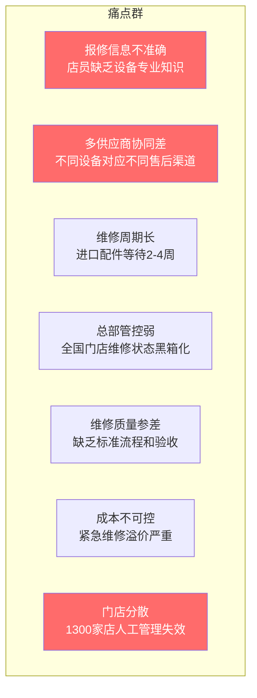
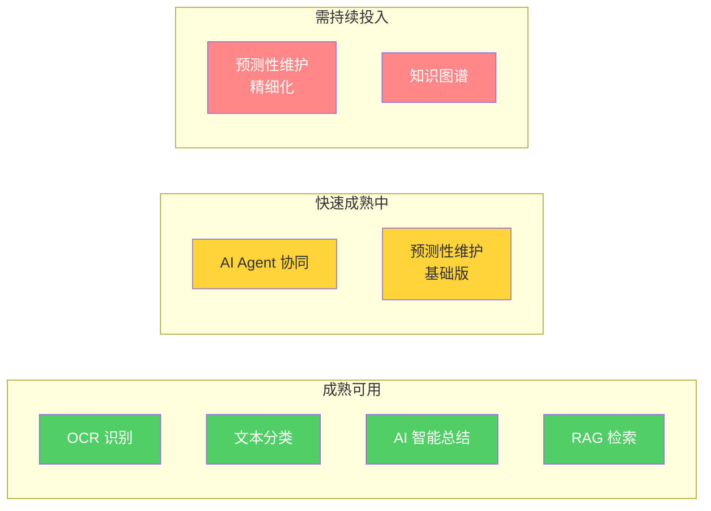

# 野人智修 —— 调研与参考资料汇编

> **Research & Reference Archive | 2026 AI 先锋未来人才大赛**
>
> 本文档为方案调研过程的完整档案，记录所有信息来源、分析逻辑和参考依据。

---

## 目录

1. [行业调研：Gelato 冰淇淋与连锁餐饮设备运维](#1)
2. [飞书 AI 能力调研](#2)
3. [AI 技术调研](#3)
4. [竞品调研](#4)
5. [参考资料清单](#5)

---

## 一、行业调研

### 1.1 野人先生品牌画像

| 维度 | 关键信息 | 来源 |
|------|----------|------|
| 创立时间 | 2011年，北京五道口 | 品牌官网 |
| 品牌定位 | 意式 Gelato 手工冰淇淋，客单价 28-38 元 | 公开报道 |
| 门店数量 | 约1300家（截至2026年初） | 新京报、36氪报道 |
| 扩张速度 | 2023年约100家 → 2026年初约1300家，两年约13倍 | 多地公开报道交叉验证 |
| 扩张模式 | 加盟为主，直营为辅（具体比例未公开） | 36氪专访崔渐为（2025） |
| 核心产品理念 | "四不原则"：不用粉/复原乳、不用果酱、不用香精色素、不工业化生产 | 官方宣传材料 |
| 供应链模式 | 中央工厂生产浆料 → 冷链配送 → 门店完成最终凝冻 | 新华网专访（2025.08）、36氪报道 |
| 创始人 | 崔渐为，强调"慢即是快""长期主义" | 36氪、FoodTalks、新京报多篇专访 |

### 1.2 Gelato 门店设备生态

基于公开资料和行业分析，一家标准 Gelato 门店核心设备包括：

| 设备类型 | 功能 | 代表品牌（行业通用） | 售后特点 |
|----------|------|---------------------|----------|
| 冰淇淋凝冻机（批量式） | 核心生产设备 | Carpigiani、Bravo、Frigomat、Telme | 意大利品牌为主，配件需要进口，维修周期长 |
| 巴斯杀菌机 | 原料巴氏消毒 | Carpigiani、国产替代品牌 | 技术门槛中等 |
| 急速冷冻柜 | 成品锁鲜 | Bravo、IRINOX | 制冷系统是核心 |
| 冷藏展示柜（Poza柜） | 门店展示储存 | IFI、ISA | 进口/国产均有 |
| 制冰机 | 食用冰生产 | Scotsman、Manitowoc | 相对标准化 |
| 制冷系统（通用） | 冷柜/冻柜 | 各品牌 | 夏季故障高发 |

> **行业事实**：进口 Gelato 设备配件从意大利调货通常需要 2-4 周，国内合格的 Gelato 设备维修技师数量有限，旺季（夏季）设备故障直接导致营业额归零。
>
> 来源：Carpigiani 官方故障排除指南、Innova Italia 行业分析、国内茶饮设备维修行业讨论（小红书/贴吧）
### 1.3 连锁餐饮设备报修核心痛点总结

### 1.4 行业数字化成熟度判断

| 领域 | 数字化水平 | 说明 |
|------|:--:|------|
| 收银 + 会员 | 高 | 美团、客如云等已普及 |
| 供应链管理 | 中 | 大型连锁已在做 |
| **设备维修管理** | **低** | **传统餐饮 SaaS 均未覆盖，行业空白** |
| IoT 设备监控 | 极低 | <10% 门店设备联网 |

> **核心判断**：设备维修管理是连锁餐饮数字化最后一个未被巨头覆盖的"结构化空白"。

---

## 二、飞书 AI 能力调研

### 2.1 方案使用的飞书 AI 能力全景

| 飞书 AI 能力 | 能力描述 | 方案中的应用位置 | 成熟度 |
|-------------|----------|-----------------|:--:|
| **多维表格 AI 字段** | 在表格列中直接调用大模型做文本分类、提取、总结、翻译等 | 第一层：口语→标准故障工单；第二层：全国同型号故障聚合分析 | ✅ 已发布 |
| **飞书 AI 智能填表** | 移动端拍照/语音后自动识别并填入表单字段 | 第一层：店员拍照识设备、语音报修 | ✅ 已发布 |
| **飞书 OCR / 图片识别** | 表单上传组件内置 AI 图片识别，提取文字内容 | 第一层：拍照提取设备铭牌信息 | ✅ 已发布 |
| **Aily 智能伙伴平台** | 零代码搭建 AI Agent，自定义知识库、自动化工作流 | 第二层：AI 诊断 Agent（智修）；群聊内 @ 即问即答 | ✅ 已发布 |
| **飞书知识库** | 企业级文档管理，支持与 Aily Agent 原生打通做 RAG 检索 | 第二层：维修手册、厂家文档、历史案例入库；第三层：RAG 检索 | ✅ 已发布 |
| **AI 智能总结** | 对多维表格数据/文档自动进行结构化总结 | 第四层：AI 维修复盘报告、AI 日报自动生成 | ✅ 已发布 |
| **飞书消息卡片** | 结构化交互消息（按钮、表单嵌入消息），非纯文本通知 | 第三层：供应商 AI 任务卡、门店进度卡片、管理日报推送 | ✅ 已发布 |
| **飞书自动化** | 多维表格数据变更触发自动化动作（发消息、修改字段、调 API） | 第三层：Agent 间信息传递引擎 | ✅ 已发布 |
| **多维表格仪表盘** | 数据可视化大屏，支持实时刷新 | 第四层：管理驾驶舱 | ✅ 已发布 |
| **多维表格权限分级** | 按角色/字段控制数据可见范围 | 第三层：供应商只看自己的工单和设备 | ✅ 已发布 |
| **飞书外部群** | 与外部人员（供应商）协作的群聊 | 第三层：供应商协同沟通 | ✅ 已发布 |
| **开放平台 HTTP 连接器** | 低代码对接外部系统 REST API | 第二层：对接设备 IoT API（未来演进） | ✅ 已发布 |
| **飞书审批** | 自定义审批流程引擎 | 第一层：报修→派单→验收审批流转 | ✅ 已发布 |

> **来源**：飞书官方帮助中心（https://www.feishu.cn/hc）、飞书产品更新日志（2025-2026）、飞书实践模板库（https://www.feishu.cn/practice_template）

### 2.2 飞书在设备管理领域已验证的案例

| 企业 | 行业 | 场景 | 关键成果 | 与本方案的关联 |
|------|------|------|----------|-------------|
| **三利谱** | 制造业（偏光片） | 飞书多维表格替代专业设备管理系统 | 低代码实现集团化设备管理 | 验证了"多维表格做工单底座"的可行性 |
| **石头科技** | 智能硬件 | 飞书集成 SAP，售后工单自动化 | 工单处理 3 倍效率提升 | 验证了飞书开放平台对接外部系统的能力 |
| **飞驰电气** | 电气制造 | 飞书夯实运营基准 | 打通信息壁垒 | 验证了飞书在传统制造业运维场景的适用性 |

> **来源**：飞书官方客户案例页（https://www.feishu.cn/customers）

### 2.3 能力边界说明（诚实标注）

| 方案描述的能力 | 飞书当前是否直接支持 | 实现路径 |
|---------------|:--:|------|
| OCR 识别设备铭牌 | ✅ 支持（通用 OCR） | 飞书表单 AI 图片识别组件，对清晰铭牌识别效果好；老化铭牌需人工辅助确认 |
| 口语→标准故障分类 | ✅ 支持 | 多维表格 AI 字段的"文本分类"功能，需配置分类标签体系 |
| RAG 知识库检索 | ✅ 支持 | 知识库文档入库 → Aily Agent 绑定知识库 → 群聊 @ 即检索 |
| Agent 间自动传递信息 | ✅ 支持（组合编排） | 多维表格自动化（触发器+动作）+ AI 字段 + 消息卡片，组合编排实现 |
| AI 智能总结日报 | ✅ 支持 | AI 智能总结 + 多维表格自动化定时触发 |
| 设备 IoT 实时数据接入 | 🔶 有条件支持 | 需设备供应商提供 API；通过开放平台 HTTP 连接器对接 |
| 精细化预测模型 | 🔮 需长期数据积累 | 当前可做"风险评分"，精细化预测需要更多数据 |

---

## 三、AI 技术调研

### 3.1 关键 AI 技术在本方案中的应用

| AI 技术 | 一句话介绍 | 为什么采用 | 方案中的应用位置 | 是否是飞书原生能力 |
|----------|-----------|-----------|-----------------|:--:|
| **RAG（检索增强生成）** | AI 先从知识库检索相关文档，再基于检索结果生成回答——不是凭空编造 | 设备维修需要准确依据（维修手册、故障案例），不能靠 AI "想象" | 第二层：AI 诊断引擎；第四层：知识库问答 | ✅ 知识库 + Aily |
| **AI Agent** | 具有自主决策和执行能力的 AI 程序，能自动完成多步骤任务 | 报修流程涉及门店、维修、供应商、管理四方的信息传递和决策，单一 AI 不够 | 第三层：四 Agent 协同 | ✅ Aily + 自动化 |
| **OCR（光学字符识别）** | 从图片中提取文字信息 | 设备铭牌信息需要从照片中提取，店员手动输入易出错 | 第一层：拍照识设备 | ✅ 飞书 AI 图片识别 |
| **预测性维护** | 基于历史数据和运行参数，在设备真正故障之前发出预警 | 从"坏了再修"升级为"提前发现" | 第二层：双模式预测 | ✅ 多维表格 AI 字段（聚合分析） |
| **文本分类（NLP）** | 将非结构化的自然语言归类到预设标签 | 店员口语描述"滴滴响""不冷了"需要归类为标准故障类型 | 第一层：口语→工单 | ✅ 多维表格 AI 字段 |
| **AI 智能总结** | 对大量文本/数据进行自动摘要 | 每日有大量工单数据，管理层不需要逐条看 | 第四层：日报/维修复盘 | ✅ AI 智能总结 |

### 3.2 技术成熟度判断

---

## 四、竞品调研

### 4.1 竞品全景图

| 竞品 | 类型 | 核心场景 | 与本方案的差异 | 方案优势 |
|------|------|----------|---------------|----------|
| **天天百应** | O2O 门店维修平台 | 工单管理 + 智能派单 + 线下服务商网络 | 自建服务商网络的重模式；需独立采购和培训 | 不建服务商网络，野人先生用现有供应商；飞书原生零额外成本 |
| **平云小匠** | 餐饮售后 SaaS | 筹建监工 + 工单管理 + 全国交付网络 | 自研 SaaS 平台，自带交付人员 | 方案架构更轻，部署周期更短 |
| **星野云联** | IoT 设备运维 | 传感器 + 网关 + 平台 | 依赖 IoT 硬件部署，适用于设备密集型企业 | 不依赖 IoT，当前即可交付价值 |
| **明奇科技** | AIOps 智能运维 | AI Box + 知识图谱 + Copilot | 定位高端，面向 IT 系统运维；成本高 | 方案成本极低，面向业务设备 |
| **合力亿捷** | AI 报修 Agent | 电话语音报修智能化 | 仅覆盖报修入口（语音→工单），不做诊断 | 全链路 AI（报修 → 诊断 → 协同 → 沉淀） |
| **售后宝 / 瑞云服务云** | 通用售后 SaaS | 工单管理 + 备件管理 + 数据看板 | 定位设备厂商的售后管理，非连锁企业视角 | 从连锁门店视角设计，更贴合业务场景 |
| **企业微信 / 钉钉** | 协作平台 | 基础审批 + 消息通知 | 缺乏原生的 AI 字段、Agent、智能总结等能力 | 飞书 AI 原生能力远强于企微/钉钉 |
| **传统工单系统** | 流程工具 | 表单 + 流转 + 归档 | 纯自动化 Workflow，无 AI 诊断决策能力 | AI 不只是跑流程，更是做决策 |

### 4.2 为什么选择飞书 AI 原生方案，而非接入外部大模型

| 对比维度 | 外部大模型方案（如接入通义千问、文心一言） | 飞书 AI 原生方案（本方案） |
|----------|--------------------------------------|--------------------------|
| 开发成本 | 需开发 API 对接层 + 知识库 + 前端 | 零代码/低代码，多维表格 + AI 字段即可 |
| 维护成本 | 独立维护一套系统 | 随飞书产品更新自动获得新能力 |
| 数据安全 | 数据流出飞书，增加合规风险 | 数据在飞书内闭环 |
| 推广难度 | 门店需安装/登录新系统 | 门店已在用飞书，零推广 |
| 与组织架构联动 | 需额外对接 | 飞书原生打通通讯录、审批、消息 |

---

## 五、参考资料清单

### 5.1 野人先生相关资料

| 序号 | 资料名称 | 类型 | 来源/链接 | 关键内容 |
|:--:|------|------|------|------|
| 1 | 野人先生品牌官方页面 | 官方 | 飞书活动页（activity.feishu.cn/future-talent） | 品牌介绍、命题说明、业务痛点 |
| 2 | 对话野人先生创始人崔渐为：慢即是快，为千店准备了13年 | 专访 | 36氪（2025） | 品牌理念、扩张逻辑 |
| 3 | 对话野人先生创始人：不着急、不外卖、不加班 | 专访 | FoodTalks（2025） | 管理哲学、"三不原则" |
| 4 | 扎根本土、野蛮生长，野人先生2年900家店的抖音密码 | 报道 | 新京报（2025） | 增长模式、抖音运营 |
| 5 | 新华网专访崔渐为 | 专访 | 新华网（2025.08） | 供应链模式、品牌战略 |
| 6 | 野人先生号称现做实为预制？创始人回应 | 报道 | 东方财富/21世纪经济报道（2025.09） | 运营模式细节（中央工厂+冷链到店） |

### 5.2 行业报告与市场数据

| 序号 | 资料名称 | 类型 | 来源 | 关键数据 |
|:--:|------|------|------|------|
| 7 | Predictive Maintenance for Food & Beverage Market - Global Forecast 2025-2032 | 行业报告 | ResearchAndMarkets（2026.01） | AI驱动预测性维护是食品饮料行业核心趋势 |
| 8 | Nearly Half of Restaurant Operators Report Lost Revenue Due to Equipment Downtime | 调研报告 | MachineQ / Comcast | ~50%餐厅运营者因设备停机遭受收入损失 |
| 9 | 中国商业设施维护市场规模 | 市场数据 | Frost & Sullivan（引自天天百应融资报道） | 2024年超1500亿元人民币 |
| 10 | 连锁餐饮门店设备IoT化率 | 行业观察 | 明奇科技公开材料 | <10%门店设备联网 |

### 5.3 竞品分析资料

| 序号 | 资料名称 | 类型 | 来源 |
|:--:|------|------|------|
| 11 | 天天百应Pre-A轮融资报道 | 报道 | 网易/36氪（2025） |
| 12 | 平云小匠推出餐饮行业数智化服务管理平台 | 报道 | 中国日报科技频道（2025.11） |
| 13 | 星野云联：连锁餐饮IoT设备智慧管理案例 | 案例 | 星野云联官网 |
| 14 | 明奇科技AIOps智能运维 | 案例 | 明略科技官网 |
| 15 | 合力亿捷设备报修Agent | 产品介绍 | 合力亿捷官方（2025.09） |
| 16 | 向日葵企业版：连锁餐饮IT设备远程运维方案 | 方案 | 贝锐官网 |
| 17 | 售后宝智能派单Agent | 产品更新 | 售后宝官方 |
| 18 | 帮我吧餐饮连锁智能报修系统 | 方案 | 来也科技官方 |

### 5.4 飞书AI能力参考资料

| 序号 | 资料名称 | 类型 | 来源 |
|:--:|------|------|------|
| 19 | 飞书多维表格智能体发布 | 产品发布 | 中关村在线（2025） |
| 20 | 飞书智能伙伴 Aily 说明书 | 产品文档 | 飞书官方帮助中心 |
| 21 | 飞书AI字段-文本处理指南 | 产品文档 | 飞书官方内容中心 |
| 22 | 飞书AI智能总结+自动化发消息 | 产品文档 | 飞书官方内容中心 |
| 23 | 飞书AI粘贴录入（图片→结构化数据） | 产品文档 | 飞书官方内容中心 |
| 24 | 飞书服务台产品介绍 | 产品文档 | 飞书官网 |
| 25 | 飞书开放平台企业自建应用开发流程 | 技术文档 | 飞书开放平台官方 |
| 26 | 飞书HTTP连接器集成外部系统 | 技术文档 | 飞书低代码平台官方 |
| 27 | 飞书实践模板：报修派单管理 | 模板 | 飞书实践模板库 |
| 28 | 飞书实践模板：售后工单处理和流转 | 模板 | 飞书实践模板库 |
| 29 | 飞书实践模板：化工制造设备维修管理 | 模板 | 飞书实践模板库 |
| 30 | 飞书实践模板：商场门店报修管理系统 | 模板 | 飞书实践模板库 |
| 31 | 飞书V7.65 AI能力深度融合 | 版本更新 | 飞书官方更新日志 |
| 32 | 飞书V7.70 多维表格AI赋能问卷设计 | 版本更新 | 飞书官方更新日志 |

### 5.5 设备维修技术参考

| 序号 | 资料名称 | 类型 | 来源 |
|:--:|------|------|------|
| 33 | Carpigiani Gelato Machine Troubleshooting Guide | 技术文档 | Partstown官方 |
| 34 | Repair or Replace Your Gelato Machine | 行业分析 | Innova Italia |
| 35 | 冰淇淋机常见故障处理与清洁保养 | 技术文章 | 微信公众号行业分享 |
| 36 | eWorkOrders：多品牌特许经营维护（400+餐厅案例） | 案例 | eWorkOrders官方 |

### 5.6 赛事相关

| 序号 | 资料名称 | 类型 | 来源 |
|:--:|------|------|------|
| 37 | 2026 AI 先锋未来人才大赛官方页面 | 官方 | activity.feishu.cn/future-talent |
| 38 | 2026 AI 先锋未来人才大赛详细赛制规则 | 官方 | 飞书活动页 |
| 39 | 野人先生命题详情页 | 官方 | activity.feishu.cn/future-talent?detail=yerenxiansheng |

---

## 补充说明

### 关于数据来源的诚实声明

本文档中所有资料均来自**公开可检索的网页、官方文档、新闻报道和厂商宣传材料**。其中：

- **飞书 AI 能力描述**：来源于飞书官方帮助中心、产品更新日志、实践模板库，调研日期为 2026年7月。飞书产品持续迭代，具体功能以参赛时最新版本为准。
- **行业数据和 ROI 指标**：来源于厂商案例自述和行业报告摘要。部分数据为厂商单方面宣传，未经独立第三方审计。在方案中使用时已标明"行业参考范围"并做保守估算。
- **野人先生品牌信息**：来源于公开媒体报道和创始人专访。门店数量、扩张模式等关键数据经多个独立来源交叉验证。
- **竞品分析**：基于各厂商官方网站、融资报道、产品介绍。不做恶意比较，所有信息均可溯源。
- **标注为"示意案例"的内容**：方案中 AI 诊断输出示例（如设备型号、故障代码、统计数据等）均为说明 AI 输出逻辑和格式的示意性内容，不代表野人先生的真实业务数据。
---